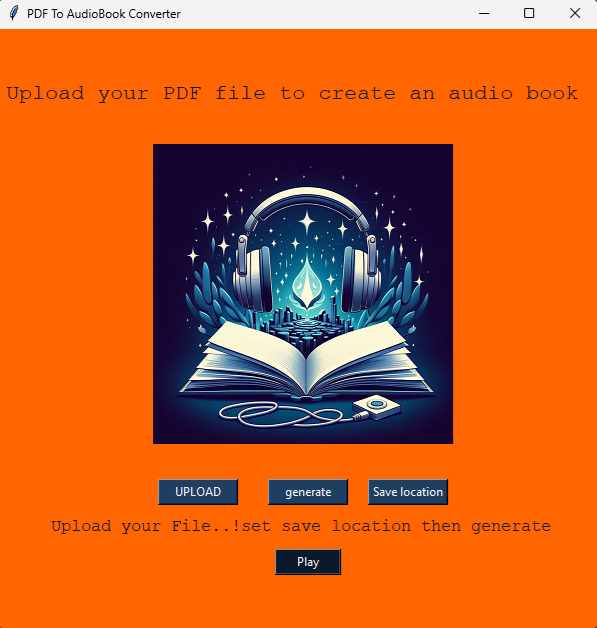

# PDF to AudioBook Converter 🎧

This is a Python-based GUI application that converts a PDF file into an audiobook using `pyttsx3`. It extracts text from the PDF and converts it into a spoken MP3 file.

## Features  
- Upload a PDF and extract its text  
- Convert extracted text into an MP3 audiobook  
- Save the generated audio file to a custom location  
- Play the audiobook directly from the application  


## Screenshot


## Requirements  
Install dependencies using:  
```sh
pip install -r requirements.txt
